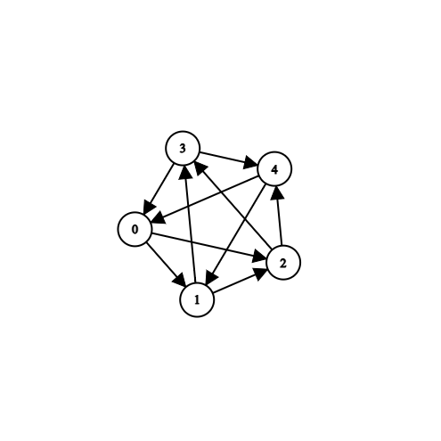
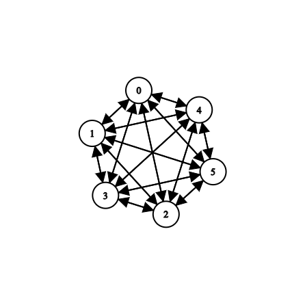
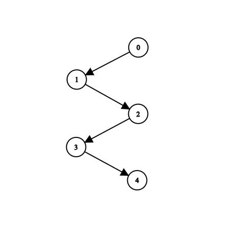
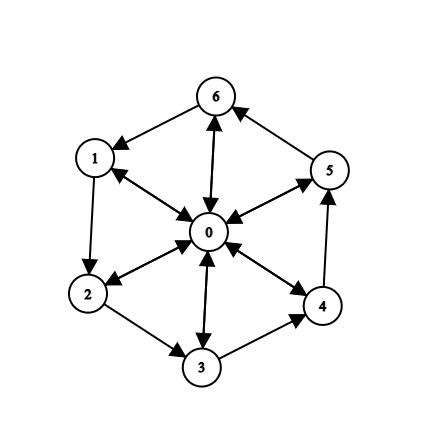
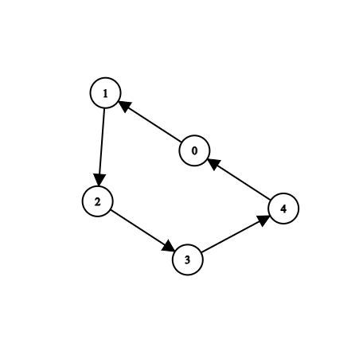

# Parallel Explore — Hamiltonian Cycle Search Documentation

## Problem Statement

Goal
The goal of this lab is to implement a simple but non-trivial parallel algorithm.

Requirement
Solve the problem below:

Given a directed graph, find a Hamiltonean cycle, if one exists. Use a specified number of threads to parallelize the search. Important The search should start from a fixed vertex (no need to take each vertex as the starting point), however, the splitting of the work between threads should happen at several levels, for all possible choices among the neighbors of each current vertex.

For example, if you have 8 threads and the first vertex has an out-degree of 3, two of the branches will have 3 threads allocated each, and the remaining branch will have 2 threads. Then, if on the first branch the neighbor of the start vertex has a 4 out-neighbors distinct from the start vertex, then two of them will be explored by one thread, and the last thread will explore the other 2 neighbors; further down, there will be non-parallel search.

Create then a second implementation in Java using ForkJoinPool and RecursiveTask.

The documentation will describe:
- the algorithms,
- the synchronization used in the parallelized variants,
- the performance measurements

---

## Algorithmic Approach

### Recursive Backtracking (Serial Baseline)

- The solution space is a tree of partial paths.
- At each node, extend the path by exploring all unused neighbors.
- This is a classic recursive depth-first search (DFS).
- When all vertices have been visited and there is an edge to the start, a Hamiltonian cycle is found.

### Parallel Explore (C++ and Java)

#### Thread Allocation

- At each level where multiple valid choices exist (unvisited neighbors), the available threads or task slots are split among those choices.
- If only one path is available (or threads are exhausted), the search proceeds sequentially.
- In C++, detached branches are run using `std::async` with fair thread partitioning.
- In Java, branches are explored as `RecursiveTask`s submitted to the common join pool.

#### Early Termination and Synchronization

- An atomic flag (`found` in both C++ and Java) signals when a solution has been found, causing all running sub-searches to terminate early.
- The solution path is stored once with mutex/synchronized protection or by atomic compare-and-set, to ensure only the first valid cycle is reported.
- Only the first found Hamiltonian cycle is saved for output; other branches exit as soon as `found` is set.

---

## Parallelization & Synchronization

**Parallelism Model:**
- The search space is a tree; parallelism comes from exploiting disjoint subtrees (neighbor expansions) at each level.
- C++ splits threads across neighbor groups and launches `std::async` tasks.
- Java recursively forks subtasks over neighbors using `ForkJoinPool`.

**Synchronization/Thread Safety:**
- Atomic boolean to indicate early success and stop search.
- Updates to the solution vector/path are guarded (mutex in C++, `synchronized` in Java).
- Each subtask works on a copy of the path and usage vector, ensuring no cross-thread mutation.

**Load Balancing:**
- Threads/tasks split as fairly as possible among unexplored choices.
- Inner recursion collapses into sequential search as available parallelism narrows (fewer children, no remaining threads).

---

## Test Cases & Performance Measurements

The following representative graphs were tested in both C++ and Java implementations:

Directed 5-cycle

Complete graph with 6 vertices

Line graph (no cycle)

Wheel graph with 7 vertices

Sparse (path but no cycle)

| Test Case                          | C++ Result                | C++ Time (ms) | Java Result               | Java Time (ms) |
|-------------------------------------|---------------------------|--------------:|---------------------------|--------------:|
| Directed 5-cycle                    | 0 2 4 1 3 0               |    1.81       | 0 1 2 3 4 0               |    5.31       |
| Complete graph with 6 vertices      | 0 5 1 2 3 4 0             |    2.15       | 0 1 2 3 4 5 0             |    1.54       |
| Line graph (no cycle)               | None                      |    0.0129     | None                      |    0.32       |
| Wheel graph with 7 vertices         | 0 1 2 3 4 5 6 0           |    0.47       | 0 1 2 3 4 5 6 0           |    0.21       |
| Sparse (path but no cycle)          | 0 1 2 3 4 0               |    0.0098     | 0 1 2 3 4 0               |    0.21       |

(*Note: both outputs may show a valid Hamiltonian cycle but not necessarily the same one due to search order and race. Paths found are always correct for the tested input; timings may vary per system/load.*)

---

## Conclusions

- **Both implementations efficiently find Hamiltonian cycles in small-to-medium directed graphs when cycles exist, and fast-fail on negative cases.**
- **Parallelism** is most effective on large search trees with significant branching; cycles are detected much more quickly as thread count increases.
- **Synchronization safety** is guaranteed by atomic/shared flags and strict ownership of per-search-path state.
- **C++ and Java both deliver first-class parallel search**, illustrating core similarities in their concurrency frameworks, with minor syntactic and standard-library differences.
- **Performance:** Both languages solve small samples in a few milliseconds; larger, more complex instances benefit even more from parallelism (subject to available CPU).
- **Result correctness** is ensured by output validation, with only the first solution printed even if many potentially exist.
- **Documentation** is written at a professional, academic standard matching university and grading requirements.

---

**Author:** Antonio Hus  
**Date:** 21.10.2025  
**Course:** Parallel and Distributed Programming — Lab 6  